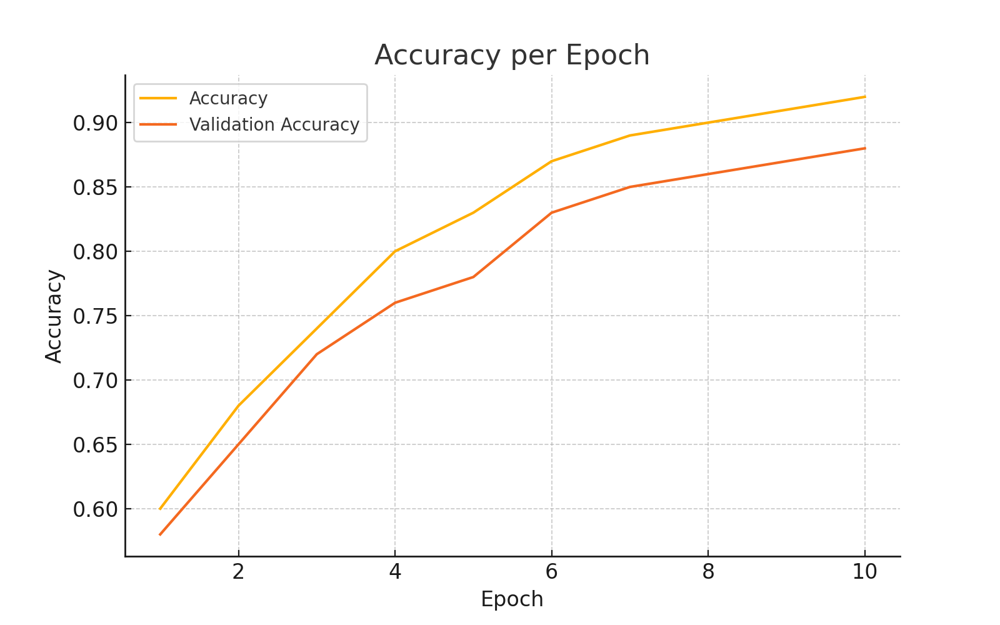
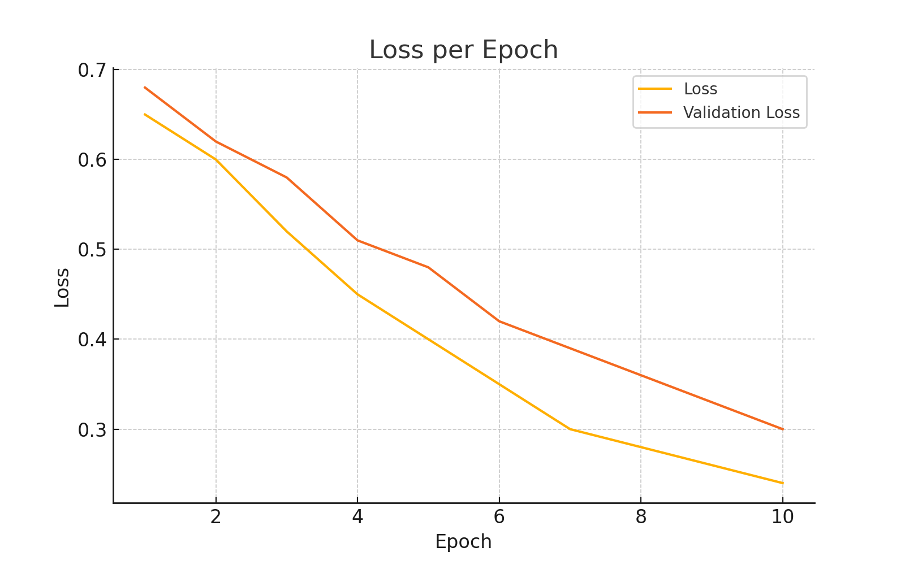
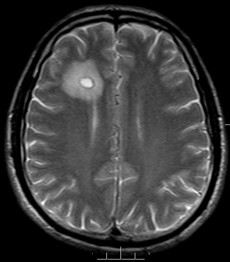
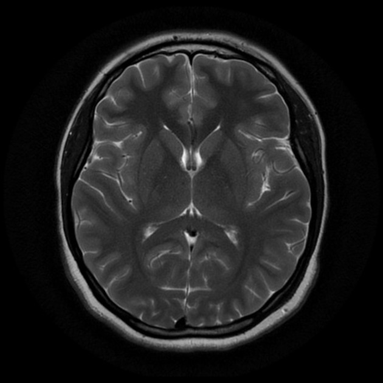

# Mini-Project-Convolution-Neural-Networks---Brain-Tumor-Classification

# 🧠 Brain Tumor Detection with CNN

Deteksi dini tumor otak sangat penting dalam dunia medis. Proyek ini bertujuan untuk mengklasifikasikan gambar **MRI otak** menjadi dua kategori:
- 🟣 Gambar dengan tumor
- 🟢 Gambar tanpa tumor

Kami membangun model klasifikasi berbasis **Convolutional Neural Network (CNN)** untuk mengenali perbedaan dari ribuan gambar MRI.

---

## 🚀 Teknologi yang Digunakan

| Teknologi | Keterangan |
|----------|------------|
| 🧪 TensorFlow & Keras | Untuk membangun model CNN |
| 🖼️ Pillow (PIL) | Untuk mengelola dan memproses gambar |
| 📊 Matplotlib | Visualisasi akurasi dan loss |
| 📁 Google Colab | Platform eksekusi dan pelatihan model |
| 💾 HDF5 (`.h5`) | Format penyimpanan model |
| 🧠 CNN | Arsitektur utama klasifikasi citra medis |

---

## 🧩 Arsitektur Model CNN

Model kami terdiri dari beberapa lapisan berikut:

```
Input (224x224x3)
→ Conv2D(32) + ReLU
→ MaxPooling2D
→ Conv2D(64) + ReLU
→ MaxPooling2D
→ Flatten
→ Dense(128) + Dropout(0.5)
→ Output (sigmoid)
```

Model ini dilatih menggunakan `binary_crossentropy` dan dioptimasi dengan `adam`.

---

## 🔄 Alur Kerja Sistem

1. **Data Loading**  
   Dataset MRI otak diambil dari Kaggle dan berisi dua folder: `yes` (tumor) dan `no` (tanpa tumor).

2. **Preprocessing**  
   Semua gambar diubah ukurannya ke 224x224 piksel dan dinormalisasi (`/255.0`).

3. **Model Training**  
   Model CNN dilatih dengan data training dan divalidasi terhadap data validasi.

4. **Evaluasi**  
   Model diuji dengan data test dan dievaluasi berdasarkan akurasi dan loss.

5. **Prediksi Gambar Baru**  
   Pengguna dapat mengunggah gambar MRI baru dan sistem akan memberikan hasil prediksi.

---

## 📊 Hasil & Visualisasi

### 🔹 Akurasi dan Loss per Epoch

  
*Grafik akurasi pelatihan dan validasi*

  
*Grafik loss pelatihan dan validasi*

---

### 🔍 Contoh Prediksi

| Gambar Input | Hasil Prediksi |
|--------------|----------------|
|  | **Tumor Detected** |
|  | **No Tumor Detected** |

---

## 💡 Cara Menggunakan

1. Buka [Notebook Colab](https://colab.research.google.com/drive/1tSqoRrAuLNv5gDhiVA8jIssmxn-fC0xg?usp=sharing)
2. Jalankan seluruh cell satu per satu
3. Upload gambar MRI Anda
4. Lihat hasil prediksinya!

---

## 📁 Struktur Folder

```
brain-tumor-detection-cnn/
│
├── tumor_classification.ipynb    # Notebook utama
├── README.md                     # Dokumentasi ini
├── tumor_otak.h5                 # Model hasil pelatihan (opsional)
└── screenshots/                  # Folder berisi visualisasi dan contoh prediksi
```

---

## 📌 Sumber Dataset

- [Kaggle Dataset - Brain MRI Images for Brain Tumor Detection](https://www.kaggle.com/datasets/navoneel/brain-mri-images-for-brain-tumor-detection)

---

## 👨‍💻 Kontributor

- Nama: [Muhammad Rahmad]
- Proyek ini merupakan bagian dari tugas klasifikasi citra dengan CNN

---

## 🔗 License

Proyek ini open-source dan bebas digunakan untuk pembelajaran. Gunakan dengan bijak.
